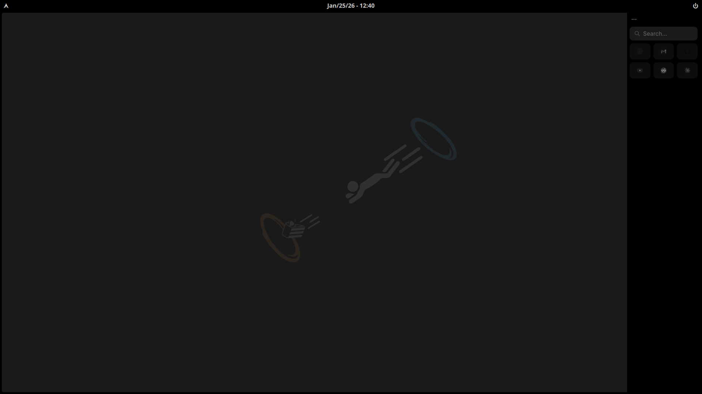
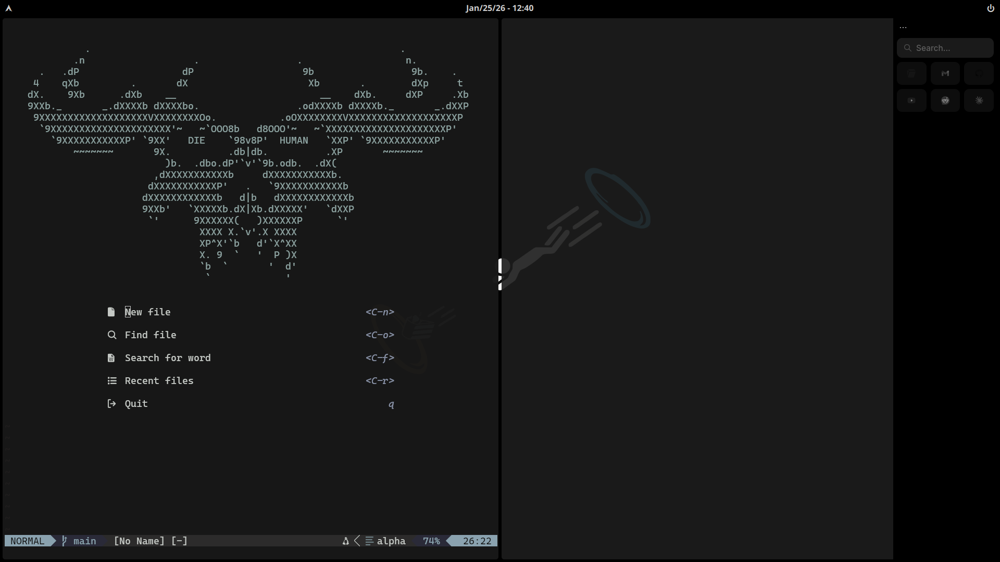

<div align="center">
  <h1>💎 Ernst's dotfiles 💎</h1>
  
  
  
  <h3>🚧  Work in Progress  🚧</h3>
  <a href="#-about">About</a>&nbsp;&nbsp;&nbsp;|&nbsp;&nbsp;&nbsp;
  <a href="#-screenshots">Screenshots</a>&nbsp;&nbsp;&nbsp;|&nbsp;&nbsp;&nbsp;
  <a href="#-themes">Themes</a>&nbsp;&nbsp;&nbsp;|&nbsp;&nbsp;&nbsp;
  <a href="#-installation">Installation</a>
</div>

## 🏮 About
> [!WARNING]
> Don’t blindly use my settings unless you understand what they entail. Use at your own risk!

These are the configuration files I use in my daily life. I hope they can help you as well!

Programs' configuration files that you will find in this repository:

| Type               | Name                        |
| ------------------ | --------------------------- |
| OS                 | Arch Linux                  |
| WM                 | Hyprland                    |
| Terminal           | Alacritty & Kitty           |
| Shell              | Zsh                         |
| Launcher           | Rofi                        |
| Top Bar            | Quickshell                  |
| Text Editor        | Neovim                      |
| ZSH Prompt         | Starship                    |
| ZSH Plugin Manager | Zinit                       |
| File Manager       | Nautilus & Yazi             |
| Video Player       | mpv                         |

## 📸 Screenshots
**⚠️ Illustrative images do not represent the final result! ⚠️**




## 🎨 Themes
| Program  |    Theme      |
| -------- | ------------- |
| Font     | CascaydiaCove |
| Ghostty  | Zeists        |
| Icons    |               |
| Folders  |               |
| Cursors  | [Colloid-Cursors](https://github.com/vinceliuice/Colloid-icon-theme/tree/main/cursors) |

## 💾 Installation
### Dotfiles
Quick install:
```sh
git clone https://github.com/ernstbecker/dotfiles && cd dotfiles && stow .
```

## 🆘 Need help?
- Create an [issue](https://github.com/ErnstBecker/dotfiles/issues/new)
- Read the [stow](https://www.gnu.org/software/stow/manual/stow.html) manual
