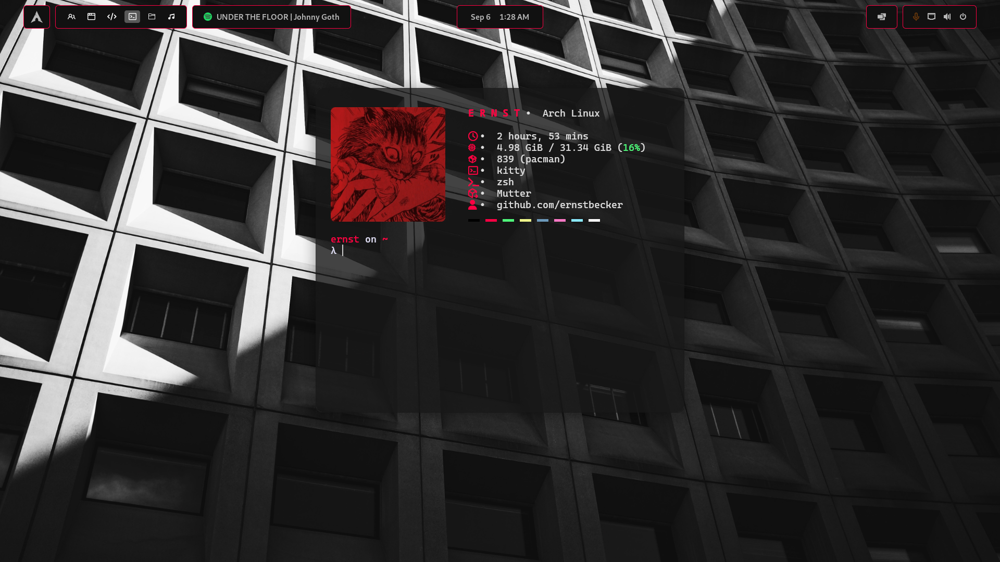
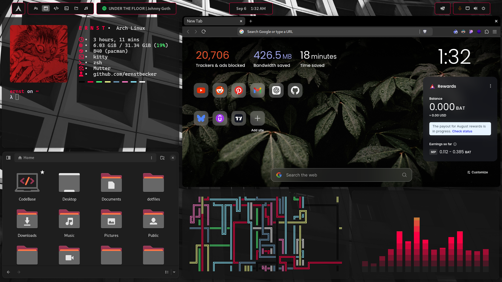
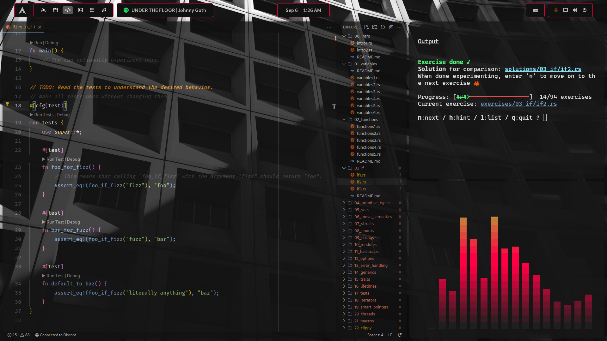

<div align="center">
  <h1>💎 Ernst's dotfiles 💎</h1>
  
  
  
  <h3>🚧  Work in Progress  🚧</h3>
  <a href="#-about">About</a>&nbsp;&nbsp;&nbsp;|&nbsp;&nbsp;&nbsp;
  <a href="#-screenshots">Screenshots</a>&nbsp;&nbsp;&nbsp;|&nbsp;&nbsp;&nbsp;
  <a href="#-themes">Themes</a>&nbsp;&nbsp;&nbsp;|&nbsp;&nbsp;&nbsp;
  <a href="#-installation">Installation</a>
</div>

## 🏮 About

> [!WARNING]
> Don’t blindly use my settings unless you understand what they entail. Use at your own risk!

These are the configuration files I use in my daily life. I hope they can help you as well!

Programs' configuration files that you will find in this repository:

| Type               | Name                        |
| ------------------ | --------------------------- |
| OS                 | Arch Linux                  |
| Terminal           | Ghostty & Alacritty & Kitty |
| Shell              | Zsh                         |
| Video Player       | mpv                         |
| Launcher           | Rofi                        |
| IDE                | VisualStudioCode            |
| ZSH Prompt         | OhMyPosh                    |
| ZSH Plugin Manager | Zinit                       |
| File Manager       | Yazi                        |

## 📸 Screenshots
**⚠️ Illustrative images do not represent the final result! ⚠️**





## 🎨 Themes
| Program  |    Theme      |
| -------- | ------------- |
| Font     | CascaydiaCove |
| Ghostty  | Zeists        |
| VSCode   | Zeists        |
| Icons    |               |
| Folders  |               |
| Cursors  | [Colloid-Cursors](https://github.com/vinceliuice/Colloid-icon-theme/tree/main/cursors) |

## 💾 Installation
### Dependencies
For the installation of programs dependencies (fonts, themes, programs, etc.). You can run the script.
```bash
chmod +x Scripts/install.zsh
zsh Scripts/install.zsh
```
### Dotfiles
If you need help with the stow command, you can read [here](https://www.gnu.org/software/stow/manual/stow.html).
```bash
stow .
```
